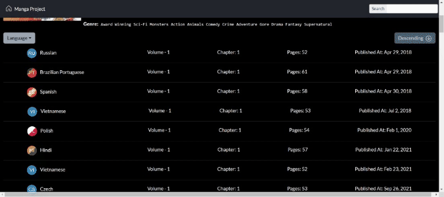

# MangaProject

This project was generated with [Angular CLI](https://github.com/angular/angular-cli) version 17.1.0.

This webpage allows you to search for and read a diverse selection of comics from Japan, Korea, and China, with translations available in multiple languages.

## Installation Instructions

 Steps to install and modify this project:

- You need to have Angular and Node installed at your machine
- Clone the repository
- Open the folder in a terminal and run `npm i`
- Then run `ng serve`
- Navigate to `http://localhost:4200/`
- The application will automatically reload if you change any of the source files.

## Screenshots

### Desktop

#### Home Responsive

#### Carousel

#### Show More button

#### Search

#### Manga Detail

#### Pagination

#### Change Chapter

#### Go to Top Button

---

### Mobile

#### Carousel 

#### Search

## Folder Structure

The main folders are

- **app**: where all the components are
  - **pipe**: all the custom pipes to format languages
  - **services**: all services to acess manga information
- **assets**: has all the the internal images and logo

## API Documentation

This project uses [MangaDex API](https://api.mangadex.org/docs/) to get all the manga information.

## Contact Information

- [Linkedin](https://www.linkedin.com/in/liara-programadora/)

- [Youtube](https://www.youtube.com/channel/UCkjlpKaG0SUeCQso6Lt2gbg)
